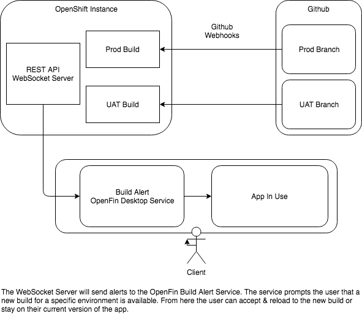

# zero-downtime-trading-web-ux

Showcases how the OpenFin API, in conjunction with the ODP OpenShift Infrastructure and APIs, can create a powerful experience to live-reload an app and swap its environment from production to UAT

## How Does It Work

The Websocket Client can be found [here](https://github.com/dcchuck/openshift-ws-alerts)
